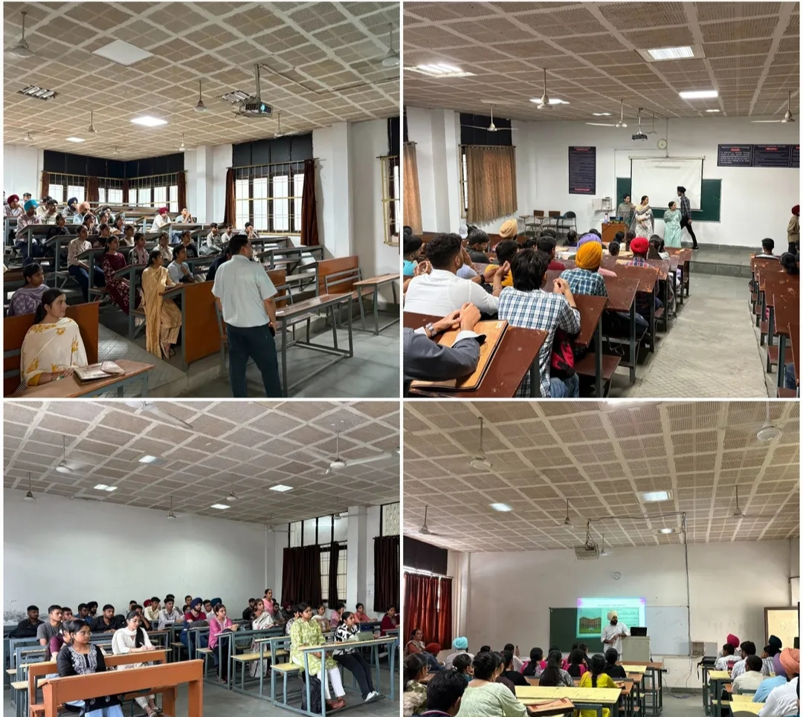

# Guru Nanak Dev Engineering College
# Induction program 2025
## Bhavneet kaur 
## Father's name Alwinder singh 
## CSA
## Registration no 2510539
## Whatsapp no 9815612308
## Email bhavneetbansal69@gmail.com
 
## Day 1
## Gurudwara Sahib 
* The day began with listening to Japji Sahib(path) and Hymns(shabad kirtan) such as satguru hoye dhyal  which means ,"When the guru is merciful ,you will know no pain ,you will never grieve and your desires are fulfilled".These and many other hymns were recited at college gurudwara sahib.Then after ardaas , Pathi sahib shared some very inspiring words and gave us his blessings.

## Auditorium 
* After that we all students went to the college auditorium.There,the host of the event welcome us and introduced the college's legacy through a detailed presentation.Also, in the presentation,there was a two videos of college pass-outs.One of them was Sangam Arora and other was Arshdeep singh. They shared their experiences.More specifically, they explained how dedication and involvement beyond the classroom shaped their successful journey.
* Then the host invited the first speaker, Dr. Harpreet Kaur (HOD of Applied Science Department).They congratulations to us to get admission in college and give us very simple but effective speech.Through her speech I feel like I am the member of gne college already.
* Then,our principal sir(Dr.Sehijpal singh) motivates us through his speech and he also  tells us about the Gne college has celebrated his 70th anniversary in this year.I feel vey lucky that i get a chance to be a part of this college when the college is celebrating his 70th Anniversary.
* Then, Dr. Aashray Girdhar sir and Dr.parminder singh also welcomed us by sharing his views and motivated us to do our best in the future.
## Special guests of the day
* Er.Ravinder Garg (Chief Engineer, Municipal Corporation, Ludhiana). He congrats us and give us best wishes for future.
* Er. Rakesh Kumar – ADC Ludhiana He was also GNDEC Alumnus, Batch 1991.He shared their college experiences and gave us tips for achieving success in the future.
* Also , In the induction program a loan officer is there and he  also gave a speech about the student loan scheme.He explained how students can get a loan with interest and return it after their graduation is completed.

## Visit Department of CSE
* After this, the program ended for the day. Then, the teachers of the Computer Science department showed us the classrooms and labs of the department. Mrs. Kiran Joyti Ma'am (HOD of the CSE department) gave us brief information about programming.

* This is how my Day 1 of the Induction went.
## Day 2 
## Proficiency test 
* The Day 2 of the induction began with a Proficiency English Test. The test included questions based on topics we had already studied in our previous school classes. After the English test, there was also a Mathematics Proficiency Test, which also covered concepts we had learned earlier. However, some questions were quite difficult, but I tried my best to find the answers.

## Auditorium 
* After the proficiency tests, there was a one-hour break. Following the break, all the students of IT and CSE gathered in the auditorium.
### Scholarship program 
* A lecture was conducted on a scholarship program provided by Buddy4Study, named the Satya Scholarship Program 2025. The representatives of this scholarship program gave us a brief overview and assured us that 50 students from our college would be selected for the scholarship. This program is really helpful for those who are unable to pay their fees.
### Food:A Pivotal role 
* Then there was an expert lecture by Dr. Arashdeep Singh on "Food: A Pivotal Role in Students' Overall Wellness."
He highlighted how a balanced and nutritious diet not only supports physical health but also enhances mental focus, emotional stability, and academic performance. The session emphasized the importance of including fresh fruits, vegetables, whole grains, and adequate hydration in daily meals. Sir also encouraged students to avoid junk food and adopt mindful eating habits to maintain long-term wellness.
### GitHub 
* After the above lecture, our seniors introduced us about the GitHub app. With their guidance, we created our GitHub accounts and made our first repository.
 They also explained that GitHub is very useful for students like us, especially in coding and teamwork. It helps us save our code safely, track changes, and work together on projects. It’s also good for building our profile, which can help us later in internships or placements. I really found it interesting because it was my first time using such a platform or coding app.
 ## Reflections 
 * Overall, I really enjoyed Day 2 of the induction program and learned many new things. As a first-year student, everything feels new and exciting to me. Today’s sessions helped me understand how many opportunities and resources are available in our college. The scholarship session gave hope to students who need financial support, and I found it really inspiring. The expert talk on food and wellness made me realize how important it is to take care of our health, especially when we are starting a new phase of life. I will definitely try to eat healthier from now on.
* The GitHub session was also very interesting. I had never used GitHub before, but with the help of our seniors, I created my account and made my first repository. It made me feel like I’ve taken my first small step into the world of coding and development. I was nervous at first, but now I feel more confident and motivated.
* I’m really thankful to the college, teachers, and seniors for putting so much effort into making us feel comfortable and helping us learn from the very beginning. I feel proud to be a part of this college, and I’m looking forward to the upcoming days of the induction program with great excitement.

## Day 3 
## Lecture by Dr.Jaswinder Singh Sir
* Day 3 of our induction program began with a very interesting and inspiring expert lecture by Dr. Jaswinder Singh sir, who is the retired incharge of IAPT (Indian Association of Physics Teachers). He delivered a unique session that beautifully connected Physics, Mathematics, and spiritual values. As a first-year student, I found this lecture very engaging and full of learning.
  Sir explained various concepts of physics and maths through simple and fun tricks and experiments which made learning more enjoyable and easier to understand. It was not just about formulas or theories – he showed us how these subjects are actually connected to our daily lives. The best part was how he also connected the teachings of Gurbani with scientific knowledge, which gave us a new perspective on life, values, and learning.
  Dr. Jaswinder Singh’s way of teaching was very motivating. He encouraged us to think logically, stay curious, and always look for answers. His energy and passion made the lecture more enjoyable. I truly liked and enjoyed his session.
  
* The Chief Guest, S. Gurcharan Singh Grewal, Secretary of SGPC, also motivated us with his inspiring speech. He appreciated Dr. Jaswinder Singh for his valuable contribution in spreading scientific knowledge through engaging experiments and linking it with spiritual values. He also thanked him for fulfilling his responsbilities so well.
## Universal human values 
* After that, we attended an expert lecture by Dr. Priya Darshni Mam on Universal Human Values. She beautifully explained the importance of values in our personal and professional lives. Through her interactive session, we learned how values like respect, honesty, compassion, and responsibility help us become better human beings.
* She also told us about the importance of right understanding in life and how it is related to physical facilities. She explained that if we develop the right understanding, then only we can manage our relationships and physical needs properly. Physical facilities alone are not enough for a happy life. If someone has all the physical comforts but lacks good relationships, they still can't stay truly happy.
* She also explained the difference between happiness and excitement. Happiness is something that stays with us for a long time – it is stable and continuous. On the other hand, excitement is temporary – it lasts for a few moments and then fades away.
## Assignment
* She also gave us assignment on "How much time and effort you put in everyday in these 3 areas(Relationship, Physical facility and Right understanding ) other than for sleeping (say 8 hours)"?
* I spend 1.5 hours on Right understanding, 9.5 hours on Physical facilities, 2.5 hours on Relationship and 2.5 hours on other miscellaneous activities.
* Throw this I realised that most of my time goes into studies physical related things like eating , watching pak dramas , netflix etc. I am giving some time to family and friends but I think , I can improve a bit in the Right understanding area like spending more time in self reflection , reading meaningful content or meditation . This exercise really helped me realize how much my day is structured and then i can make it better 
## Reflection 
* Overall, it was a day full of motivation, learning, and self-reflection. The sessions not only boosted our academic thinking but also helped us understand the deep connection between knowledge and human values. As a fresher, it was a new and eye-opening experience to see how subjects like Physics and Mathematics can be taught with such passion and meaning. It also made me realize how important it is to build strong moral values along with technical skills. These teachings will definitely help us become more responsible, confident, and balanced individuals as we begin our journey in college life. I feel grateful to be a part of this induction program.

## Day 4 
### lectures 
* Day 4 of our induction program began with a P2P (Peer-to-Peer) lecture delivered by our senior, Kusum mam. She explained everything very clearly and in a friendly manner, which made it easy for us to understand. The session was mainly focused on programming, especially in C++. She introduced us to the basic concepts of C++ and also demonstrated some simple coding examples. Through her guidance, we got a better idea of how programming works and how we can start building our logic. It was a very helpful session for us as freshers, and we truly appreciated her efforts in making us feel comfortable with a new subject.
* Then, after the above lecture, we attended a session on BEEE (Basic Electrical and Electronics Engineering) by Prof. Harminder Kaur Ma’am from the ECE department. In the beginning, Mam interacted with us and took our introduction one by one. She also asked us about our strengths and weaknesses, which made the session more engaging and interactive. After that, she gave us a brief introduction to the subject and explained what topics we will study throughout the semester. It helped us understand the scope and importance of BEEE in our engineering journey. As first-year students, it was a good start to get familiar with the subject structure and what to expect in future classes.
### Lecture on Universal Human Values by Dr. Priya Darshni Ma'am

* After the break, we had a very insightful and meaningful lecture on Universal Human Values (UHV) by Dr. Priya Darshni Mam. She talked about the Program for Fulfillment of Basic Human Aspirations, focusing on the two key aspects every human being wants – happiness and prosperity. She explained that for long-lasting happiness, we need right understanding, not just physical facilities or temporary pleasures.
* Mam discussed the importance of balancing three main areas in life – Right Understanding (in the Self), Relationship (with human beings), and Physical Facility (with rest of nature). These three together help us live in harmony, and achieve mutual happiness and mutual prosperity.
* Mam showed how chasing temporary pleasure can lead to excitement at first, but then to depression and stress, especially when there is disharmony within the Self. She encouraged us to focus on continuous happiness which comes from right feelings, right understanding, and responsibility.
* In the end, she told us not to blindly believe everything, but to verify each proposal based on our own natural acceptance – a very empowering message for all of us as students. I found the session deeply thoughtful, and it helped me look at life in a new and positive way.
### Causmic club 
* After that, we were introduced to the Causmic Club of our college. The members of the club gave us a brief overview of what the club is all about and the various activities they organize throughout the year. They told us that the Causmic Club is focused on technical and creative development and provides a platform for students to showcase their talents in different fields. They also explained the types of events they conduct, such as competitions, workshops, and fests. We also came to know about the sponsors who support the club and help in organizing large-scale events. It was a great introduction, and it made many of us excited to participate and become part of such active student communities in the future.
## Reflection 
* Day 4 started with a P2P lecture by our senior Kusum di. She explained C++ programming in a very simple and friendly way and also showed some basic coding examples. It was helpful for us as beginners.

After that, we attended a session on BEEE by Prof. Harminder Kaur Ma’am. She first took our introduction and asked about our strengths and weaknesses. Then she gave a brief overview of the subject and told us what we will study in the semester.

Later, we had a lecture on Universal Human Values by Dr. Priya Darshni Ma’am. She explained about happiness, prosperity, and how right understanding, relationships, and physical facilities help us live in harmony. Her session made us think deeply about life.

In the end, the Causmic Club of our college was introduced. They told us about the events they organize, their purpose, and who sponsors them. It was exciting to know about student clubs and upcoming opportunities.

Overall, it was an informative and interesting day.

## Day 5 
### Campus explore 
* On Day 5, our ID cards were being made, and since the process was going on according to the alphabetical series, our turn came a bit late. During this waiting time, our seniors encouraged us to explore the campus. So, we decided to utilize the time by exploring different parts of GNE Ludhiana. We visited the Gurudwara Sahib situated inside the college, which gave us a peaceful and spiritual feeling. After that, we saw the college dispensary, post office, and various blocks of different departments. We also explored the playgrounds, the sports complex, and some sitting areas where students usually relax during breaks. The environment was very welcoming, and it gave us a better understanding of the campus layout. It was quite a good experience overall, and it helped us feel more comfortable and excited about our upcoming journey at the college.
## Reflection 
* As a first-year student, Day 5 was quite memorable for me. Even though we were waiting for our ID cards due to the alphabetical process, our seniors made sure our time didn't go to waste. Exploring the GNE campus gave me a sense of excitement and belonging. Visiting the Gurudwara Sahib brought peace to the mind, and seeing facilities like the dispensary, post office, and sports complex showed how well-equipped the college is for student needs. It was also a great chance to interact with other freshers and seniors. This small campus tour made me feel more confident and comfortable in this new environment, and I’m really looking forward to the experiences ahead.

## Day 6
### Chemistry lecture 
* Day 6 started with a Chemistry lecture conducted by Karan Bhalla Sir.
At the beginning of the session, sir interacted with us and took our introduction. During the introduction, he also asked about our future goals. It was a good way to motivate us and understand our interests.
* After the interaction, he gave us important information about the upcoming Mid-Semester Tests (MSTs) — including how they will be conducted, syllabus coverage, and preparation tips.
* Then he introduced the Chemistry syllabus and started the topic of Water Chemistry. He explained how impurities are detected in water and discussed methods of purification like the lime soda process, zeolite process, and ion exchange method. He also talked about the presence of heavy metals in water and how they can be harmful.
* Overall, the session was very informative.
### English lecture 
* Then there was an English lecture by Prof. Nisha Mam.
* Mam was very experienced and confident. She gave us an interesting activity in which we had to introduce ourselves, including our strengths, weaknesses, and achievements. It was a great way to boost our confidence and improve our speaking skills.
* Unfortunately, my turn didn’t come, but I still learned a lot by listening to others. Mam also told us that the focus of this subject was the development of communication skills, which are very important for our future.
### Auditorium sessions 
* After the break, there was a lecture by S. Gurcharan Singh Grewal, Secretary of SGPC in auditorium.
* His way of speaking was very simple and easy to understand. He shared information about the history of GNE College and also introduced himself. He told us about the achievements of the college and how it has built a strong reputation over the years.
* He also mentioned that GNE College is well-known even in foreign countries because many of its students are working abroad and making the institution proud. His speech was inspiring and gave us a sense of pride for being part of such a reputed institution.
### CML club and NPTEl exams
* Then we had a lecture by Dr. Lakhvir Singh Khanna, Incharge of the Centre for Multifaceted Learning (CML).
* He introduced us to his club, the Centre of Multifaceted Learning, and explained how it helps students develop multiple skills beyond academics. The club focuses on overall personality development and provides opportunities for students to grow in different fields.
* He also introduced us to the NPTEL (National Programme on Technology Enhanced Learning) platform and explained how it can help us in the future. Through this platform, students can learn from IIT professors, earn certificates, and improve their technical as well as soft skills. It was a very informative session that encouraged us to take part in such learning opportunities.
## Reflection – Day 6
* Day 6 was full of learning and new experiences. The day started with an engaging Chemistry lecture by Karan Bhalla Sir, where we not only learned about water chemistry but also understood the importance of purification methods like lime soda and zeolite processes. Sir’s explanation was clear and easy to understand.
* Then, in the English lecture by Prof. Nisha Mam, we were encouraged to introduce ourselves and speak about our strengths, weaknesses, and achievements. Even though my turn didn’t come, I observed and learned a lot from others. It helped me realise how important communication skills are, and that this subject is not just about grammar but about real self-development.
* After the break, S. Gurcharan Singh Grewal Sir, Secretary of SGPC, gave a motivational speech. He told us about the history and reputation of GNE College, especially how it is respected even in foreign countries. His words made me feel proud to be part of such a prestigious institution.
* The day ended with an insightful lecture by Dr. Lakhvir Singh Khanna Sir, who introduced us to the Centre for Multifaceted Learning and the NPTEL platform. I learned how important it is to build skills outside of academics and how these platforms can support our personal and professional growth.

* Overall, Day 6 was very informative and inspiring. It gave me motivation to improve myself in both academic and non-academic areas.

## Day 7 
### Information regarding college and different college clubs 
* Day 7 began with an insightful lecture by Dr. Parminder Singh sir, the Dean of Student Welfare.
He warmly welcomed us and gave a detailed introduction to the college's vibrant student life. He talked about the various student clubs that operate within the campus and the wide range of activities and events organized by college every year. From cultural festivals to technical competitions and sports events, he encouraged us to actively participate in activities.
### Digital marketing club (DMC)
* Following that, we attended a lecture by Dr. Amit Kamra sir , the in-charge of the Digital Marketing Club (DMC).
He introduced us to the club, its objectives, and the core team members who actively contribute to its success. Dr. Kamra sir also showcased some of the impressive work done by his students as part of the club's activities. He mentioned that the club focuses on nurturing students' talents in the field of digital marketing by giving them hands-on experience. He also explained how interested students can join the club and become part of its various projects and initiatives. Additionally, he informed us that all the official social media accounts of GNDEC — including Facebook, Instagram, YouTube, and others — are managed by him and his team.
### Information related to examinations 
* After that, Dr. Randhir Singh sir conducted a lecture on the rules and procedures related to examinations.
He explained the importance of attendance and how it is linked to eligibility for exams, including Mid-Semester Tests (MSTs) and final exams. He also introduced us to the academic portal and the Guru Portal, a dedicated platform where students can access important information related to attendance, exam schedules, results, and fee payments. Through this portal, students can stay updated with all academic and administrative activities throughout the semester.
### Lectures 
* After the initial lectures, we had a short break, followed by our regular academic sessions.
The first class was BEEE (Basic Electrical and Electronics Engineering), in which the teacher discussed the syllabus with us and gave a brief overview of the first chapter on DC Circuits and basic electrical components.
* Later, we attended a P2P (Peer-to-Peer) session, conducted by our seniors Harjot Singh sir and Yuvraj Singh sir. They began by interacting with us and getting to know the new students through short introductions. They then introduced the basic concept of the Programming program and explained it very well to us .
## Reflection:
Day 7 was a highly informative and engaging day that gave us valuable insights into both academic and extracurricular aspects of college life. Through the lectures, we got to know about different clubs such as the Digital Marketing Club and their role in enhancing students’ skills and talents beyond the classroom. Learning about the examination system, attendance requirements, and the use of the Guru Portal made us aware of important rules and resources that will guide us throughout our academic journey. The BEEE class gave us a clear start to our syllabus, beginning with DC circuits, which sparked our interest in the subject. The P2P session with our seniors Harjot Singh sir and Yuvraj Singh sir was not only interactive but also inspiring, as they shared their experiences and encouraged us to actively participate in college activities. Overall, the day helped us explore new opportunities, understand our responsibilities, and feel more connected to the college environment. It was a perfect blend of learning, interaction, and motivation.

## Day 8
### Millets-The super power 
* Day 8 started with an extremely informative and engaging lecture by Mrs. Shaffy Makkar mam on the topic "Millets – The Super Power". She began by telling us about the history of millets, explaining how they have been a part of traditional diets for thousands of years but are now regaining popularity due to their amazing health benefits. She explained that millets are packed with nutrients like protein, fiber, vitamins, and minerals, making them a complete food for overall wellness. She also told us how they are naturally gluten-free, which makes them suitable for people with gluten intolerance.
* Mrs. Shaffy mam shared that millets not only improve digestion and boost immunity but also help in controlling blood sugar levels and maintaining a healthy weight. She emphasized their role in reducing the risk of lifestyle diseases like diabetes and heart problems. In addition to health benefits, she highlighted their environmental advantages — they require less water, grow well in dry regions, and are more resilient to climate changes compared to other grains like wheat or rice. This makes them a sustainable crop that supports both human health and the planet.
* The session also included some interesting tips on how to include millets in our daily meals — from making millet porridge for breakfast to preparing rotis, khichdi, and even healthy snacks. She encouraged us to experiment with millet-based recipes and shared that many popular dishes can be made healthier by replacing refined grains with millets.
* As a first-year fresher student, I found the lecture extremely valuable. It not only gave me knowledge about a superfood I had overlooked but also inspired me to make small but impactful changes in my eating habits. I realized that adopting millets is not just about healthy eating but also about supporting farmers, saving water, and caring for our environment.
### Mathmatics lecture 
* Then there was a mathematics class by Ms. Gagandeep Kaur Lotey mam She began the session by introducing herself and giving us a warm welcome as first-year students. She discussed the mathematics syllabus with us in detail, explaining the topics we would be covering during the semester. Along with the syllabus discussion, she also highlighted the importance of mathematics in our daily lives. Ma’am explained that maths is not just about solving equations or memorizing formulas.She also told us how maths helps in developing problem-solving skills, logical thinking, and decision-making abilities, which are essential for success in any field. Her way of teaching made the subject feel more interesting and less intimidating. As a fresher, I felt motivated to approach maths not just as an academic requirement but as a life skill that will always be useful.
## Reflection 
* As a first-year fresher student, Day 8 was a day full of learning and inspiration. The lecture by Mrs. Shaffy Makkar mam on “Millets – The Super Power” gave me valuable knowledge about the importance of millets for both our health and the environment. I learned how such small grains can have such a big impact, and it motivated me to think about making healthier food choices.
* The mathematics class by Mrs. Gagandeep Kaur Lotey mam was equally meaningful. She not only explained the syllabus but also connected maths with real-life situations, which made me realize its true importance beyond the classroom. I understood that maths is not just a subject to pass exams but a skill that shapes the way we think and solve problems.
* Overall, Day 8 encouraged me to be more mindful — whether it’s about what I eat or how I apply knowledge in my everyday life. It was a reminder that learning is not only about books, but also about adopting better habits and perspectives for the future.

